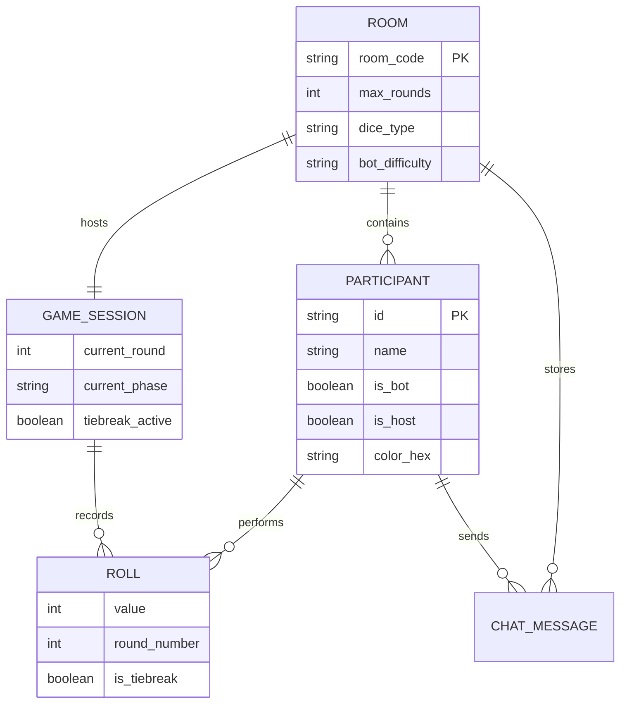

# Dice Roll Battle: Project Documentation

## Table of Contents

1. [Abstract](#1-abstract)
2. [Introduction](#2-introduction)
3. [Importance of Project Topic](#3-importance-of-project-topic)
4. [Methodology / Flow of the System](#4-methodology--flow-of-the-system)
5. [List of Tables, Entities, and Attributes](#5-list-of-tables-entities-and-attributes)
6. [ER Diagram of Project](#6-er-diagram-of-project)
7. [State Management & Real-time Logic](#7-state-management--real-time-logic)
8. [Software and Hardware Requirements](#8-software-and-hardware-requirements)
9. [Conclusion](#9-conclusion)

---

## 1. Abstract

The **Dice Roll Battle** is a real-time, web-based multiplayer game designed to provide a competitive social experience. Built using a modern stack consisting of **Node.js**, **Express**, and **Socket.io**, the application enables users to create private game rooms, customize game rules, and engage in synchronized dice-rolling competitions. The system features a custom-built AI engine, a robust tiebreaker system, and a graceful reconnection mechanism. This project serves as a comprehensive implementation of real-time state synchronization and distributed game logic.

## 2. Introduction

Multiplayer gaming requires high-fidelity state management where every player's action is validated by a central authority. "Dice Roll Battle" leverages WebSockets to maintain a persistent connection between clients and the server. The application supports up to 4 participants (including AI bots) per room. By centralizing the random number generation and turn-validation on the server, the game prevents cheating and ensures that 3D animations are perfectly synchronized across all devices.

## 3. Importance of Project Topic

The development of this system covers several critical software engineering domains:
- **AI Logic**: Implementing bots that can "decide" when to roll and have varying "luck" or "strategy" based on difficulty levels.
- **State Machines**: Managing complex transitions between phases (Lobby → Rolling → Tiebreaker → Round Result → Game Over).
- **Graceful Degradation**: Handling unexpected disconnections via a "Reconnection Window" to preserve game progress.
- **Concurrency**: Ensuring that multiple rooms can operate independently on a single Node.js instance.

## 4. Methodology / Flow of the System

1.  **Lobby Phase**: Users enter their identity. The server assigns a unique Socket ID.
2.  **Room Setup**:
    *   **Host**: Can modify game options (rounds: 3-10, dice: D4-D20) and add AI Bots.
    *   **Bots**: The server initializes bot objects with a `isBot` flag and `difficulty` trait.
3.  **Gameplay Loop**:
    *   **Turn Control**: The server maintains a `currentTurnIndex`. Only the player at that index can roll.
    *   **Bot Execution**: If the current turn belongs to a bot, the server waits a random interval (700-1500ms) before auto-generating a roll based on the bot's difficulty.
    *   **Tiebreaker Logic**: If a round ends in a tie, the server enters a specialized `isTiebreak` state, prompting only the tied players to roll again.
4.  **Persistence**: If a player disconnects, their state is moved to a `disconnected` pool for 15 seconds. If they rejoin within this window, they resume their turn and score.
5.  **Completion**: The server broadcasts a full match history and final standings.

## 5. List of Tables, Entities, and Attributes

Logical data model (currently implemented in-memory):

| Entity | Attributes | Description |
| :--- | :--- | :--- |
| **User/Bot** | `id`, `name`, `is_host`, `is_bot`, `color` | Identity of the participant. |
| **Room** | `code`, `players[]`, `opts`, `game_state` | The container for a session. |
| **Options** | `rounds`, `diceType`, `botDifficulty` | Customizable rules set by the host. |
| **Game** | `round`, `scores{}`, `phase`, `isTiebreak` | Active progress and rule tracking. |
| **Roll** | `playerId`, `value`, `isTiebreakRoll` | Data for a specific dice interaction. |

## 6. ER Diagram of Project

## 7. State Management & Real-time Logic

The server utilizes a centralized `rooms` object. Each room contains a `game` sub-object that serves as the **State Machine**.

**Key Logic Blocks:**
- `advanceTurn()`: Calculates winners, awards points, and checks for ties or game-over conditions.
- `scheduleBotTurn()`: Asynchronous timer that simulates bot decision-making.
- `rateOk()`: Prevents spamming of rolls or chat messages (Rate Limiting).
- `sanitize()`: Protects against XSS by cleaning all user-provided strings.

## 8. Software and Hardware Requirements

### Software
- **Node.js**: v14.0+
- **Socket.io**: v4.0+
- **Express**: v4.17+
- **Browser**: Chrome, Firefox, Safari (Modern versions with CSS 3D support)

### Hardware
- **Server**: 512MB RAM minimum, Single-core CPU (Standard cloud micro-instance).
- **Client**: Any device capable of rendering CSS 3D transforms.

## 9. Conclusion

"Dice Roll Battle" is more than a simple dice game; it is a demonstration of how real-time communication can transform a static web page into a living, interactive environment. The addition of configurable rules and AI opponents elevates the project from a basic utility to a full-featured gaming platform. Future improvements could include persistent database integration (PostgreSQL) and enhanced 3D rendering using Three.js.
