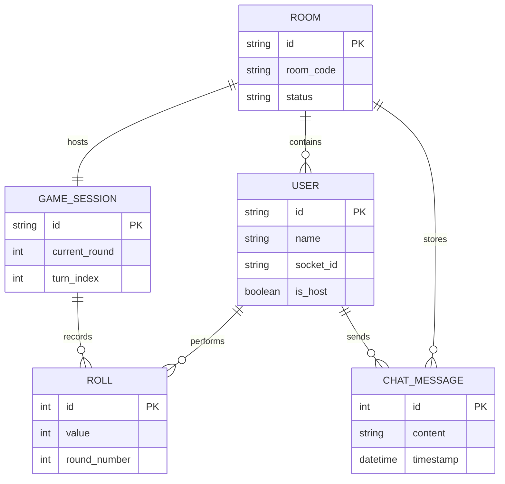

# Dice Roll Battle: Project Documentation

## Table of Contents

1. [Abstract](#1-abstract)
2. [Introduction](#2-introduction)
3. [Importance of Project Topic](#3-importance-of-project-topic)
4. [Methodology / Flow of the System](#4-methodology--flow-of-the-system)
5. [List of Tables, Entities, and Attributes](#5-list-of-tables-entities-and-attributes)
6. [ER Diagram of Project](#6-er-diagram-of-project)
7. [All Tables with Inserted Values](#7-all-tables-with-inserted-values)
8. [Software and Hardware Requirements](#8-software-and-hardware-requirements)
9. [Conclusion](#9-conclusion)

---

## 1. Abstract

The **Dice Roll Battle** is a real-time, web-based multiplayer game designed to provide a competitive social experience. Built using a modern stack consisting of **Node.js**, **Express**, and **Socket.io**, the application enables users to create private game rooms, share access codes, and engage in synchronized dice-rolling competitions. The system manages complex game states across multiple clients, handling turn-based logic, score tracking, and real-time communication. This project serves as a practical implementation of distributed system concepts and real-time networking in a web environment.

## 2. Introduction

In the era of modern web development, the demand for real-time interactivity is higher than ever. Traditional HTTP request-response models fall short in providing the low-latency updates required for multiplayer gaming. This project, "Dice Roll Battle," leverages WebSockets (via Socket.io) to bridge this gap. The application allows 2 to 4 players to join a single session where they compete over multiple rounds of dice rolls. The server acts as the central authority, ensuring that all players see the same game state and that rules are enforced consistently across the network.

## 3. Importance of Project Topic

The development of a real-time multiplayer system is a critical skill for modern software engineers. The "Dice Roll Battle" project is important for several reasons:
- **State Synchronization**: It demonstrates how to maintain a consistent "source of truth" on the server while updating multiple remote clients simultaneously.
- **Real-time Networking**: Learning to handle WebSocket events (connection, room joining, game triggers) is fundamental for building chat apps, live dashboards, and collaboration tools.
- **UI/UX for Interactivity**: The project explores how to provide visual feedback (dice animations, turn indicators) that aligns with asynchronous network events.
- **Distributed Logic**: Managing turns and calculating winners in a distributed environment requires careful architectural planning to avoid race conditions.

## 4. Methodology / Flow of the System

The system follows a linear progression from user entry to game conclusion:

1.  **Lobby Phase**: Users enter their name and choose to either "Create" a new room or "Join" an existing one using a 5-character alphanumeric code.
2.  **Room Management**: The server initializes a room object, manages the list of connected socket IDs, and assigns a "Host" status to the creator.
3.  **Synchronization**: Socket.io "rooms" are used to broadcast updates only to participants within a specific room code.
4.  **Gameplay Loop**:
    *   The host starts the game.
    *   Players take turns rolling a 6-sided die.
    *   The server generates the random value and broadcasts the "dice_rolled" event.
    *   After everyone in a round has rolled, the server calculates the round winner and awards a point.
5.  **Completion**: After 5 rounds (default), the server calculates the final scores, declares a winner, and allows the host to reset the lobby for a new game.

## 5. List of Tables, Entities, and Attributes

While the current implementation stores data in-memory for performance, the logical data model consists of the following entities:

| Entity | Attributes | Description |
| :--- | :--- | :--- |
| **User** | `id` (PK), `name`, `socket_id`, `is_host` | Stores player identity and session details. |
| **Room** | `id` (PK), `room_code`, `status`, `created_at` | Manages the logical container for a game session. |
| **GameSession** | `id` (PK), `room_id` (FK), `round_num`, `turn_index`, `is_active` | Tracks the active progress of a game. |
| **Roll** | `id` (PK), `session_id` (FK), `user_id` (FK), `round`, `value` | Records each individual die roll for audit/scoring. |
| **ChatMessage** | `id` (PK), `room_id` (FK), `user_id` (FK), `content`, `timestamp` | Stores the communication history within a room. |

## 6. ER Diagram of Project

## 7. All Tables with Inserted Values

### Table: `ROOM`
| id | room_code | status |
| :--- | :--- | :--- |
| 101 | AB12C | ACTIVE |
| 102 | XY99Z | WAITING |

### Table: `USER`
| id | name | socket_id | room_id | is_host |
| :--- | :--- | :--- | :--- | :--- |
| u1 | Alice | s_8829 | 101 | TRUE |
| u2 | Bob | s_9910 | 101 | FALSE |
| u3 | Charlie | s_4451 | 102 | TRUE |

### Table: `ROLL` (Session 101, Round 1)
| id | user_id | round | value |
| :--- | :--- | :--- | :--- |
| r1 | u1 | 1 | 5 |
| r2 | u2 | 1 | 3 |

### Table: `CHAT_MESSAGE`
| id | room_id | user_id | content | timestamp |
| :--- | :--- | :--- | :--- | :--- |
| m1 | 101 | u1 | "Good luck everyone!" | 2026-04-26 19:30:00 |
| m2 | 101 | u2 | "You too!" | 2026-04-26 19:30:05 |

## 8. Software and Hardware Requirements

### Software Requirements
- **Runtime Environment**: Node.js (v14 or higher)
- **Frameworks**: Express.js (HTTP Server), Socket.io (Real-time engine)
- **Frontend**: HTML5, CSS3 (Modern Flexbox/Grid), Vanilla JavaScript (ES6+)
- **Developer Tools**: VS Code, Chrome DevTools
- **Package Manager**: NPM (Node Package Manager)

### Hardware Requirements
- **Processor**: Dual-core 2.0 GHz or higher
- **Memory**: 4 GB RAM minimum
- **Connectivity**: Stable internet connection for WebSocket persistence
- **Client Devices**: Any modern device with a web browser (Mobile, Tablet, PC)

## 9. Conclusion

The "Dice Roll Battle" project successfully demonstrates the potential of real-time web technologies in creating engaging multiplayer experiences. By leveraging Node.js and Socket.io, the application provides a robust platform for synchronized gameplay without the need for traditional page reloads. While the current version uses in-memory storage, future iterations could integrate a database like MongoDB or PostgreSQL for persistent leaderboards and user accounts. Overall, the project achieves its goal of being a lightweight, interactive, and scalable gaming solution.
